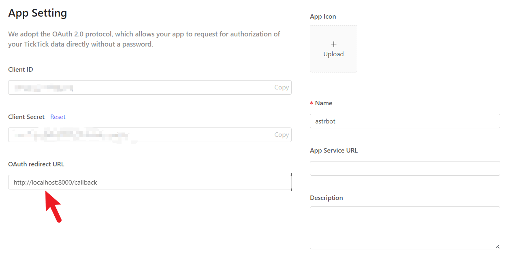
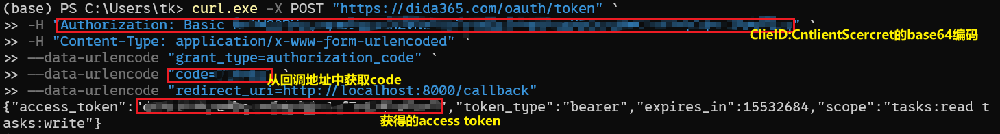
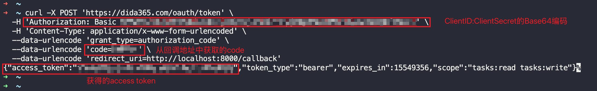
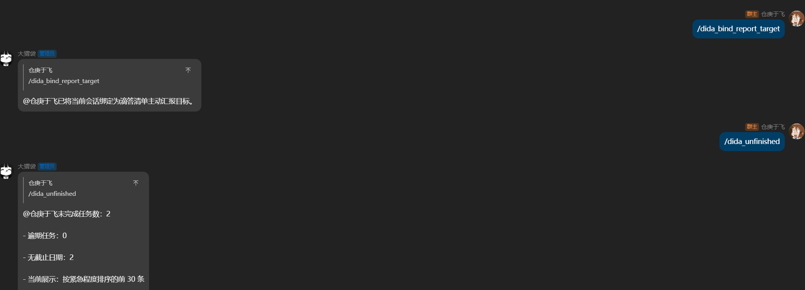

# 滴答清单连接器

滴答清单连接器是一个 AstrBot 插件，用于连接 Dida365（滴答清单）Open API，提供任务查询、定时主动汇报，以及基于 LLM 的自然语言任务操作能力。

当前版本适合以下使用场景：

- 在聊天中查询今日任务和未完成任务
- 在固定时间主动推送任务汇报
- 用自然语言创建、完成、更新、移动、删除任务

当前版本的限制：

- 不自动刷新 `access_token`
- 不支持自然语言设置汇报时间
- 不支持批量任务操作

当前版本使用手动维护 `access_token` 的方式。根据 Dida365 token 接口返回的 `expires_in` 示例，`access_token` 有效期通常约为 180 天。到期后请手动更新插件配置中的 `access_token`。

兼容性说明：当前版本已在 `metadata.yaml` 声明的 AstrBot 版本范围内验证通过。`llm` 汇报与自然语言任务操作能力依赖 AstrBot 当前内部实现，升级大版本后建议重新验证。

## 安装方式

### 方式一：通过 AstrBot 插件市场安装

在 AstrBot 插件市场中搜索安装

### 方式二：通过仓库地址安装

在 AstrBot 插件安装界面中填入仓库地址：

```text
https://github.com/zhenyumi/astrbot_plugin_dida365.git
```

## 快速开始

1. 先获取 Dida365 `access_token`
2. 在 AstrBot 插件管理界面填写 `access_token`
3. 按需设置 `default_project` 和 `timezone`
4. 执行 `/dida_ping` 检查插件是否已加载
5. 执行 `/dida_probe` 检查当前 token 是否可用
6. 执行 `/dida_today` 或 `/dida_unfinished` 验证读取能力

## Dida365 手动获取 Access Token 指南

### 1. 创建应用

在 Dida365 开发者平台 `https://developer.dida365.com/manage` 创建 app，获得：

- Client ID
- Client Secret


同时配置好回调地址，例如：




```text
http://localhost:8000/callback
```

### 2. 打开授权链接

在浏览器访问：

```text
https://dida365.com/oauth/authorize?client_id=你的_CLIENT_ID&response_type=code&redirect_uri=http://localhost:8000/callback&scope=tasks:read%20tasks:write&state=123
```

完成登录并授权。

### 3. 从回调地址中取出 code

授权成功后，浏览器会跳转到类似地址：

```text
http://localhost:8000/callback?code=ABC123&state=123
```


从浏览器的地址栏中的地址，取出其中的 `code`。

### 4. 生成 Basic 认证字符串

把下面这串内容做 Base64 编码：

```text
ClientID:ClientSecret
```

在 PowerShell 中可用：

```powershell
$plain = "你的ClientID:你的ClientSecret"
$bytes = [System.Text.Encoding]::UTF8.GetBytes($plain)
[Convert]::ToBase64String($bytes)
```
在 macOS / Linux 终端中可用：

```bash
printf '%s' '你的ClientID:你的ClientSecret' | base64
```

输出结果就是后续请求中 `Authorization: Basic 你的Base64结果` 里的 Base64 内容


### 5. 用 code 换取 access token

在 PowerShell 中执行：

```powershell
curl.exe -X POST "https://dida365.com/oauth/token" `
  -H "Authorization: Basic 你的Base64结果" `
  -H "Content-Type: application/x-www-form-urlencoded" `
  --data-urlencode "grant_type=authorization_code" `
  --data-urlencode "code=你的code" `
  --data-urlencode "redirect_uri=http://localhost:8000/callback"
```



在 macOS / Linux 终端中执行：

```bash
curl -X POST "https://dida365.com/oauth/token" \
  -H "Authorization: Basic 你的Base64结果" \
  -H "Content-Type: application/x-www-form-urlencoded" \
  --data-urlencode "grant_type=authorization_code" \
  --data-urlencode "code=你的code" \
  --data-urlencode "redirect_uri=http://localhost:8000/callback"
```


### 6. 获取结果

成功后会返回类似：

```json
{
  "access_token": "...",
  "token_type": "bearer",
  "expires_in": 15551999,
  "scope": "tasks:read tasks:write"
}
```


注意事项：

- `redirect_uri` 必须和后台配置的一致
- `code` 通常只能使用一次，过期后需要重新授权
- 不要泄露 `Client Secret` 和 `access_token`

### 7. 对话中验证配置效果



## Token 使用与更新说明

- 当前版本不自动刷新 `access_token`
- `access_token` 有效期通常约 180 天
- token 过期后，请手动更新插件配置中的 `access_token`
- 如果 Dida365 返回 `401` 或 `403`，请优先检查 token 是否已经失效

## 配置文件位置

AstrBot 实际运行时配置通常保存在：

```text
data/config/astrbot_plugin_dida365_config.json
```

本仓库提供了一个带中文注释的示例配置：

```text
data/plugins/astrbot_plugin_dida365/config.example.jsonc
```

## 配置项说明

为了便于维护，配置项按用途分为三组：基础配置、主动汇报配置、自然语言任务操作配置。

### 一、基础配置

| 配置项                    | 是否必填 | 作用                      | 何时需要修改                               |
| ------------------------- | -------- | ------------------------- | ------------------------------------------ |
| `access_token`            | 是       | Dida365 API 的访问凭据    | 第一次接入时必须填写，过期后手动更新       |
| `api_base_url`            | 否       | Dida365 Open API 基础地址 | 一般保持默认值，仅在官方文档明确要求时修改 |
| `default_project`         | 否       | 默认项目名称或项目 ID     | 当自然语言命令未明确指定项目时使用         |
| `request_timeout_seconds` | 否       | API 请求超时时间，单位秒  | 网络环境较差时可适当增大                   |
| `timezone`                | 否       | 插件业务时区              | 留空时默认继承 AstrBot 全局 `timezone`     |

说明：

- `access_token` 需要手动维护，当前插件不会自动刷新
- `timezone` 会影响“今日任务”判断、逾期判断、定时汇报和自然语言中的时间解析

### 二、主动汇报配置

| 配置项                            | 是否必填 | 作用                             | 说明                                               |
| --------------------------------- | -------- | -------------------------------- | -------------------------------------------------- |
| `enable_daily_briefing`           | 否       | 主动汇报总开关                   | 早报和晚报都受它控制                               |
| `morning_report_time`             | 否       | 今日任务早报时间                 | 格式为 `HH:MM`                                     |
| `evening_report_time`             | 否       | 未完成任务晚报时间               | 格式为 `HH:MM`                                     |
| `report_target`                   | 否       | 备用汇报目标会话                 | 更推荐使用 `/dida_bind_report_target` 绑定当前会话 |
| `enable_today_report`             | 否       | 是否启用今日任务早报             | 依赖 `enable_daily_briefing`                       |
| `enable_unfinished_report`        | 否       | 是否启用未完成任务晚报           | 依赖 `enable_daily_briefing`                       |
| `report_mode`                     | 否       | 汇报模式                         | 可选 `direct` 或 `llm`                             |
| `llm_report_prompt`               | 否       | 自定义汇报 Prompt                | 仅 `llm` 模式下使用                                |
| `llm_max_tasks`                   | 否       | 送给 LLM 的最大任务数            | 用于控制输入规模                                   |
| `include_overdue_in_today_report` | 否       | 今日汇报中是否包含逾期未完成任务 | 关闭时只汇报今天到期的任务                         |

`report_mode` 说明：

- `direct`：插件直接生成稳定文本，适合调试和排查
- `llm`：插件先整理结构化任务数据，再交给当前会话模型生成自然语言汇报

### 三、自然语言任务操作配置

| 配置项                         | 是否必填 | 作用                          | 说明                                                  |
| ------------------------------ | -------- | ----------------------------- | ----------------------------------------------------- |
| `enable_llm_task_ops`          | 否       | 是否启用自然语言任务操作      | 关闭后 `/dida_do` 不可用                              |
| `llm_task_ops_prompt`          | 否       | 自定义任务操作意图解析 Prompt | AstrBot 插件管理界面会直接显示默认 Prompt，可按需修改 |
| `confirm_low_risk_writes`      | 否       | 低风险写操作是否需要确认      | 影响 `create_task`、`complete_task`、`update_task`    |
| `confirm_high_risk_writes`     | 否       | 高风险写操作是否需要确认      | 影响 `move_task`、`delete_task`                       |
| `confirmation_timeout_seconds` | 否       | 确认等待超时时间，单位秒      | 超时后需要重新执行 `/dida_do`                         |

风险分级说明：

- 低风险：`create_task`、`complete_task`、`update_task`
- 高风险：`move_task`、`delete_task`

默认确认策略：

- `confirm_low_risk_writes = false`
- `confirm_high_risk_writes = true`

## 命令列表

### 权限说明

当前版本为了保护单账号任务数据，命令默认限制为 **AstrBot 管理员** 使用。

### 查询与诊断命令

#### `/dida_ping`

作用：

- 检查插件是否已加载
- 返回最小非敏感状态摘要

#### `/dida_probe`

作用：

- 用最小只读 API 验证当前 `access_token` 是否可用

#### `/dida_projects`

作用：

- 列出当前账号可访问的项目摘要

#### `/dida_project_data <project_id>`

作用：

- 读取单个项目的数据摘要

#### `/dida_today`

作用：

- 查询今日到期且未完成的任务

说明：

- “今日”的判定使用插件配置中的 `timezone`
- 如果部分项目读取失败，会提示“结果可能不完整”

#### `/dida_unfinished`

作用：

- 查询未完成任务

说明：

- 会按逾期情况、截止时间、优先级整理展示
- 如果部分项目读取失败，会提示“结果可能不完整”

### 主动汇报命令

#### `/dida_bind_report_target`

作用：

- 将当前会话绑定为主动汇报目标

建议：

- 在你希望接收汇报的聊天窗口中执行一次

#### `/dida_report_status`

作用：

- 查看当前主动汇报配置是否生效
- 查看汇报模式、时间配置和定时任务状态

说明：

- 为了减少敏感信息暴露，状态输出不会回显内部会话标识

### 自然语言任务操作命令

#### `/dida_do <自然语言指令>`

作用：

- 让当前会话的 LLM 先解析任务意图
- 再由插件完成任务匹配、项目匹配、参数校验、确认判断和最终 API 调用

当前支持的动作：

- `create_task`
- `complete_task`
- `update_task`
- `move_task`
- `delete_task`

示例：

```text
/dida_do 明天创建一个洗澡任务
/dida_do 把买牛奶标记完成
/dida_do 把洗澡任务改到明天晚上十一点
/dida_do 把洗澡任务移到生活项目
/dida_do 删除洗澡任务
```

#### `/dida_confirm`

作用：

- 确认执行当前待确认操作

#### `/dida_cancel`

作用：

- 取消当前待确认操作

## 主动汇报使用说明

1. 在目标会话执行 `/dida_bind_report_target`
2. 将 `enable_daily_briefing` 设为 `true`
3. 按需开启：
   - `enable_today_report`
   - `enable_unfinished_report`
4. 设置 `morning_report_time` 和 `evening_report_time`
5. 执行 `/dida_report_status` 检查配置是否生效

如果你希望更稳定地排查问题，建议先用：

- `report_mode = direct`

确认汇报内容和定时任务都正常后，再切换为：

- `report_mode = llm`

## 自然语言任务操作说明

所有自然语言任务操作都必须先经过 LLM 解析，插件不会绕过 LLM 直接按规则执行。

处理链路如下：

1. LLM 解析自然语言意图
2. 插件进行任务匹配、项目匹配和参数校验
3. 插件判断是否需要确认
4. 插件再执行最终 API 调用

插件会主动做这些安全保护：

- 任务匹配不唯一时拒绝执行
- 项目匹配不唯一时拒绝执行
- 高风险操作默认需要确认
- 不支持的动作直接拒绝

## 默认 LLM Prompt 说明

### 汇报 Prompt

如果 `report_mode = llm`，插件会使用默认汇报 Prompt。你也可以通过 `llm_report_prompt` 自定义。

### 任务操作 Prompt

AstrBot 插件管理界面的 `llm_task_ops_prompt` 输入框会直接展示默认 Prompt。你可以：

- 直接查看默认 Prompt
- 在默认 Prompt 基础上微调
- 根据自己常用的表达习惯调整措辞

建议：

- 只调整表达习惯和字段解释
- 不要删除 JSON 输出约束
- 不要删除支持动作列表


## 常见问题

### `/dida_probe` 提示 access token 未配置

说明你还没有在插件配置中填写 `access_token`。

### 提示认证失败

通常表示 `access_token` 已过期、已失效或填写错误，请手动更新后再试。

### `/dida_today` 日期不对

请优先检查 `timezone` 配置。留空时默认继承 AstrBot 全局 `timezone`。

### 任务匹配失败或匹配到多个任务

请提供更明确的任务标题，必要时补充项目名称。

### 主动汇报没有发出

请检查：

- 是否已经执行 `/dida_bind_report_target`
- `enable_daily_briefing` 是否为 `true`
- 汇报时间格式是否为 `HH:MM`
- `/dida_report_status` 是否能看到定时任务状态
- `access_token` 是否仍然有效
